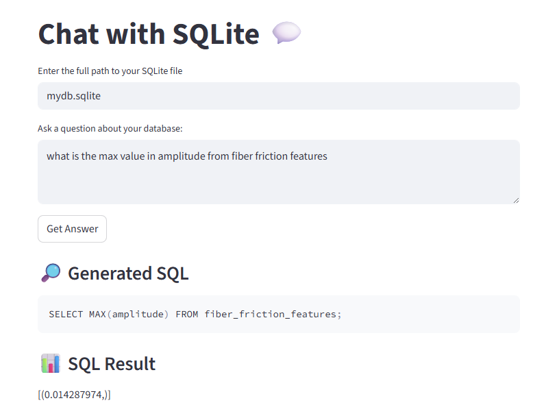
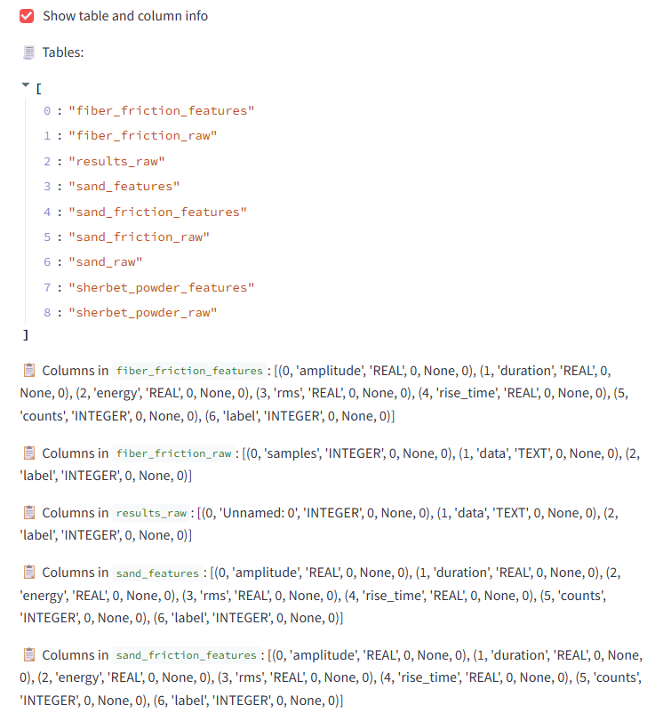

# Local SQL Agent

install ollama : https://ollama.com/

run : ollama run deepseek-coder:6.7b

python -m venv venv

.\venv\Scripts\Activate 

pip install -r requirements.txt

streamlit run app.py  

## Chat with SQLite Database using LLMs
This project provides a Streamlit web app that lets you interact with your SQLite database using natural language questions. Powered by large language models (LLMs) via Ollama, it automatically generates SQL queries from your questions, executes them, and displays the results. You can also view your database schema, including tables and columns, directly in the app.

Features:

Ask questions about your SQLite database in plain English
Automatic SQL query generation and execution
View generated SQL and query results
Inspect tables and columns in your database
Easy setup and local deployment